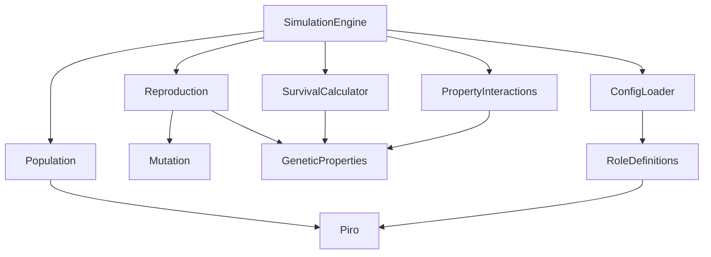

# Evolution Simulation Design Document

## Overview

The Evolution Simulation is a modular JavaScript system that simulates natural selection and genetic inheritance among beings called Piros. The architecture follows a clean separation between simulation logic, configuration management, and future frontend integration. The system is designed to run independently while being part of a larger multi-simulation ecosystem.

The simulation operates on discrete generation cycles, processing reproduction, mutation, property interactions, and survival in each cycle. The timespan acceleration allows rapid observation of evolutionary patterns across hundreds or thousands of generations.

## Architecture

### High-Level Structure

```
evolution-simulation/
├── src/
│   ├── core/
│   │   ├── Piro.js              # Piro entity class
│   │   ├── Population.js        # Population management
│   │   └── SimulationEngine.js  # Main simulation loop
│   ├── genetics/
│   │   ├── GeneticProperties.js # Property definitions and validation
│   │   ├── Reproduction.js      # Reproduction and inheritance logic
│   │   ├── Mutation.js          # Mutation mechanics
│   │   └── PropertyInteractions.js # Property interaction calculations
│   ├── survival/
│   │   └── SurvivalCalculator.js # Survivability scoring
│   ├── config/
│   │   ├── ConfigLoader.js      # Configuration file loading
│   │   └── RoleDefinitions.js   # Role-based property templates
│   └── index.js                 # Entry point and CLI interface
├── config/
│   ├── default.json             # Default simulation parameters
│   └── roles.json               # Role type definitions
└── package.json
```

### Component Interaction Flow



## Components and Interfaces

### 1. Piro Class

The fundamental entity representing a single being in the simulation.

**Properties:**
- `id`: Unique identifier (string)
- `variantId`: Genetic variant identifier - hash of genetic properties (string)
- `age`: Current age in generation cycles (number)
- `resources`: Current resource amount (number)
- `genetics`: Object containing genetic properties
  - `replicationRate`: Base reproduction frequency (0-1)
  - `attractiveness`: Reproduction success modifier (0-1)
  - `strength`: Physical survival factor (0-1)
  - `mutationChance`: Offspring mutation probability (0-1)
  - `intelligence`: Cognitive survival factor (0-1)
  - `resourceEfficiency`: How efficiently the Piro gathers resources (0-1)
- `replicationTimer`: Countdown to next reproduction attempt (number)
- `isAlive`: Survival status (boolean)

**Note:** The `variantId` is generated from the genetic properties to identify Piros with identical genetics for population tracking.

**Methods:**
- `constructor(genetics, config)`: Initialize Piro with genetic properties
- `tick()`: Advance one generation cycle, update age and timers
- `canReproduce()`: Check if replication timer has reached threshold and has sufficient resources
- `resetReplicationTimer()`: Reset timer based on replication rate with optional randomness
- `gatherResources(config)`: Collect resources based on resourceEfficiency
- `consumeResources(amount)`: Deduct resources for survival and reproduction
- `calculateSurvivability()`: Compute survival score based on genetics and current resources
- `shouldDieNaturally(config)`: Check if age has exceeded configured lifespan
- `generateVariantId()`: Create hash identifier from genetic properties

### 2. Population Class

Manages the collection of all Piros in the simulation.

**Properties:**
- `piros`: Array of Piro instances
- `generation`: Current generation number (number)
- `statistics`: Object tracking current population metrics
- `history`: Array of historical statistics for graphing

**Methods:**
- `constructor(initialSize, baseGenetics, config)`: Create initial population
- `add(piro)`: Add new Piro to population
- `remove(piroId)`: Remove Piro by ID
- `getAll()`: Return all living Piros
- `getByVariant(variantId)`: Filter Piros by genetic variant
- `size()`: Return current population count
- `updateStatistics()`: Calculate generation statistics (avg properties, survival rate, population by variant)
- `getAverageStats()`: Return average genetic properties across all living Piros
- `getPopulationByVariant()`: Return count of Piros for each genetic variant
- `recordHistory()`: Save current statistics to history array for graphing
- `getHistory(generations)`: Retrieve historical data for specified number of generations

### 3. SimulationEngine Class

Orchestrates the simulation loop and coordinates all subsystems.

**Properties:**
- `population`: Population instance
- `config`: Loaded configuration object
- `isRunning`: Simulation state (boolean)
- `cyclesPerSecond`: Timespan acceleration rate (number)
- `intervalId`: Timer reference for simulation loop

**Methods:**
- `constructor(config)`: Initialize engine with configuration
- `start()`: Begin simulation loop
- `pause()`: Halt simulation without resetting state
- `resume()`: Continue paused simulation
- `stop()`: End simulation and cleanup
- `setSpeed(cyclesPerSecond)`: Adjust timespan acceleration
- `processGeneration()`: Execute one complete generation cycle
  - Apply property interactions
  - Process resource gathering
  - Consume resources for survival
  - Process reproduction attempts (costs resources)
  - Check natural death timers
  - Calculate survival based on resources and genetics
  - Remove dead Piros
  - Update statistics

### 4. GeneticProperties Module

Defines and validates genetic property values.

**Constants:**
- `PROPERTY_BOUNDS`: Min/max values for each genetic property
- `DEFAULT_VALUES`: Fallback values when not configured

**Functions:**
- `validateProperty(name, value)`: Ensure property is within bounds
- `generateRandom(propertyName, range)`: Create random value within range
- `clampProperty(name, value)`: Force value into valid range
- `createGeneticProfile(roleType, config)`: Generate complete genetics object including resourceEfficiency

### 5. Reproduction Module

Handles offspring creation and genetic inheritance.

**Functions:**
- `attemptReproduction(parent, config)`: Try to create offspring based on parent's attractiveness and available resources
- `hasReproductionResources(parent, config)`: Check if parent has enough resources to reproduce
- `deductReproductionCost(parent, config)`: Remove resources required for reproduction
- `createOffspringGenetics(parent, config)`: Generate offspring genetics with potential mutations
- `applyInheritanceVariation(genetics, variationRange)`: Add small random changes to inherited properties

### 6. Mutation Module

Applies genetic mutations to offspring.

**Functions:**
- `mutateGenetics(parentGenetics, config)`: Create offspring genetics by evaluating mutation for each property
- `shouldPropertyMutate(propertyName, mutationChance)`: Determine if a specific property mutates
- `mutateProperty(value, mutationStrength, bounds)`: Modify a single property value
- `calculateMutationStrength(config)`: Determine magnitude of mutation
- `cloneGenetics(genetics)`: Create a copy of genetic properties object

### 7. PropertyInteractions Module

Calculates how genetic properties affect each other.

**Functions:**
- `applyInteractions(piro, config)`: Calculate property interactions for a Piro
- `calculateAttractivenessModifier(strength, intelligence, config)`: Adjust attractiveness based on other properties
- `calculateReplicationPenalty(strength, threshold)`: Reduce replication rate for weak Piros
- `calculateMutationBonus(intelligence, threshold)`: Increase mutation chance for intelligent Piros
- `getInteractionWeights(config)`: Load interaction strength parameters

### 8. SurvivalCalculator Module

Determines which Piros survive each generation.

**Functions:**
- `calculateSurvivability(piro, config)`: Compute survival score (0-1) based on genetics and current resources
- `applySurvivalCheck(population, config)`: Remove Piros below survival threshold or with depleted resources
- `applyNaturalDeath(population, config)`: Remove Piros whose age exceeds configured lifespan
- `weightedSurvivalScore(genetics, resources, weights)`: Combine genetic properties and resources into score
- `determineSurvival(score, threshold, randomFactor)`: Make probabilistic survival decision

### 9. ConfigLoader Module

Loads and validates configuration files.

**Functions:**
- `loadConfig(configPath)`: Read and parse configuration JSON
- `mergeWithDefaults(userConfig)`: Combine user config with defaults
- `validateConfig(config)`: Ensure all required parameters exist
- `getConfigValue(path, defaultValue)`: Safely access nested config values

### 10. VariantTracker Module

Tracks unique genetic variants in the population.

**Functions:**
- `generateVariantId(genetics)`: Create a hash identifier from genetic properties
- `registerVariant(variantId, genetics)`: Store a new genetic variant
- `getVariantGenetics(variantId)`: Retrieve genetic properties for a variant
- `getVariantCount()`: Return total number of unique genetic variants
- `getAllVariants()`: Return list of all genetic variants with their properties
- `getVariantPopulation(variantId, population)`: Count Piros of a specific variant

### 11. StatisticsTracker Module

Tracks and aggregates simulation data for analysis and visualization.

**Functions:**
- `calculateAverageGenetics(population)`: Compute mean values for all genetic properties
- `calculatePopulationByVariant(population)`: Count Piros grouped by genetic variant
- `trackAllVariants(population)`: Identify and count all unique genetic variants
- `generateSnapshot(population, generation)`: Create a complete statistics snapshot for current generation
- `exportHistoryForGraph(history, metric)`: Format historical data for graphing specific metrics
- `getPopulationTrends(history, variantId)`: Extract population count trends for a specific variant over time

## Data Models

### Configuration Schema

```javascript
{
  "simulation": {
    "initialPopulation": 100,
    "cyclesPerSecond": 10,
    "maxPopulation": 1000,
    "initialMode": "randomized" | "fixed"
  },
  "genetics": {
    "properties": {
      "replicationRate": { "min": 0, "max": 1, "default": 0.5 },
      "attractiveness": { "min": 0, "max": 1, "default": 0.5 },
      "strength": { "min": 0, "max": 1, "default": 0.5 },
      "mutationChance": { "min": 0, "max": 1, "default": 0.1 },
      "intelligence": { "min": 0, "max": 1, "default": 0.5 },
      "resourceEfficiency": { "min": 0, "max": 1, "default": 0.5 }
    },
    "mutationStrength": 0.1,
    "inheritanceVariation": 0.05
  },
  "resources": {
    "initialAmount": 100,
    "gatherRate": 10,
    "consumptionRate": 5,
    "reproductionCost": 50,
    "starvationThreshold": 0
  },
  "lifespan": {
    "baseLifespan": 100,
    "lifespanVariation": 20
  },
  "reproduction": {
    "spawnRandomness": 0.2,
    "attractivenessWeight": 0.7
  },
  "survival": {
    "threshold": 0.3,
    "strengthWeight": 0.6,
    "intelligenceWeight": 0.4,
    "randomFactor": 0.1
  },
  "interactions": {
    "attractivenessFromStrength": 0.4,
    "attractivenessFromIntelligence": 0.3,
    "replicationPenaltyThreshold": 0.3,
    "mutationBonusThreshold": 0.7
  },
  "mutation": {
    "perPropertyProbability": 0.15,
    "mutationStrength": 0.1
  }
}
```

### Role Definition Schema

```javascript
{
  "warrior": {
    "replicationRate": 0.4,
    "attractiveness": 0.5,
    "strength": 0.8,
    "mutationChance": 0.1,
    "intelligence": 0.4,
    "resourceEfficiency": 0.6,
    "lifespan": 60
  },
  "scholar": {
    "replicationRate": 0.3,
    "attractiveness": 0.4,
    "strength": 0.3,
    "mutationChance": 0.2,
    "intelligence": 0.8,
    "resourceEfficiency": 0.7,
    "lifespan": 70
  },
  "breeder": {
    "replicationRate": 0.7,
    "attractiveness": 0.7,
    "strength": 0.5,
    "mutationChance": 0.1,
    "intelligence": 0.5,
    "resourceEfficiency": 0.5,
    "lifespan": 50
  },
  "warrior_mutation_001": {
    "replicationRate": 0.42,
    "attractiveness": 0.53,
    "strength": 0.85,
    "mutationChance": 0.11,
    "intelligence": 0.38,
    "resourceEfficiency": 0.62,
    "lifespan": 62,
    "parentRole": "warrior"
  }
}
}
```

### Piro State Object

```javascript
{
  "id": "piro_12345",
  "variantId": "a3f5c2e1",  // Hash of genetic properties
  "age": 15,
  "resources": 50,
  "genetics": {
    "replicationRate": 0.45,
    "attractiveness": 0.62,
    "strength": 0.85,
    "mutationChance": 0.12,
    "intelligence": 0.38,
    "resourceEfficiency": 0.65
  },
  "replicationTimer": 2.3,
  "isAlive": true
}
```

### Statistics Snapshot Object

```javascript
{
  "generation": 150,
  "timestamp": 1699564800000,
  "totalPopulation": 287,
  "populationByVariant": {
    "a3f5c2e1": 85,
    "b7d9e4f2": 92,
    "c1a8f3d5": 110
  },
  "uniqueVariants": 3,
  "averageGenetics": {
    "replicationRate": 0.52,
    "attractiveness": 0.58,
    "strength": 0.61,
    "mutationChance": 0.14,
    "intelligence": 0.55,
    "resourceEfficiency": 0.63
  },
  "averageResources": 42.3,
  "averageAge": 12.5,
  "birthsThisGeneration": 23,
  "deathsThisGeneration": 18
}
```

## Error Handling

### Configuration Errors
- **Invalid property bounds**: Clamp to valid range and log warning
- **Missing configuration file**: Fall back to default configuration
- **Malformed JSON**: Throw error with file path and line number
- **Invalid role reference**: Use default role or skip role-based initialization

### Runtime Errors
- **Population extinction**: Pause simulation and emit event for frontend notification
- **Property calculation overflow**: Clamp result and log warning
- **Invalid Piro state**: Remove corrupted Piro and log error
- **Timer drift**: Recalibrate simulation loop timing

### Validation Errors
- **Out-of-bounds property value**: Clamp to valid range
- **Negative population size**: Throw error during initialization
- **Invalid cycles per second**: Clamp to reasonable range (1-1000)

## Validation Strategy

Manual validation through simulation observation:
- Run simulations with different configurations and observe evolutionary patterns
- Verify that beneficial traits increase over generations through console logging
- Monitor population statistics to ensure genetic diversity is maintained
- Test edge cases like near-extinction scenarios manually

## Implementation Notes

### Timespan Acceleration
The simulation uses `setInterval` with dynamic interval calculation based on `cyclesPerSecond`. For high speeds (>100 cycles/second), consider using `setImmediate` or `process.nextTick` to avoid timer resolution limitations.

### Random Number Generation
Use a seedable PRNG (like seedrandom library) to enable reproducible simulations for testing and debugging.

### Memory Management
Implement a circular buffer for historical statistics to prevent unbounded memory growth during long simulations.

### Future Frontend Integration
The SimulationEngine will emit events (`generation-complete`, `population-update`, `extinction`, `statistics-update`) that the shared frontend can subscribe to for visualization updates. The statistics history will be formatted for graphing libraries to display:
- Population trends over time (total and by role)
- Average genetic property evolution across generations
- Resource availability trends
- Birth/death rate charts

### Statistics Export
The system will provide methods to export historical data in formats suitable for graphing:
- Time-series data for line charts (population by role over generations)
- Current snapshot data for bar charts (average stats comparison)
- Role distribution pie charts
- Multi-line charts showing evolution of each genetic property average

### Modularity for Multiple Simulations
All evolution-specific logic is contained within the `evolution-simulation/` directory. The entry point (`index.js`) exports a standard interface that other simulation types will also implement, enabling the shared frontend to interact with any simulation type uniformly.
